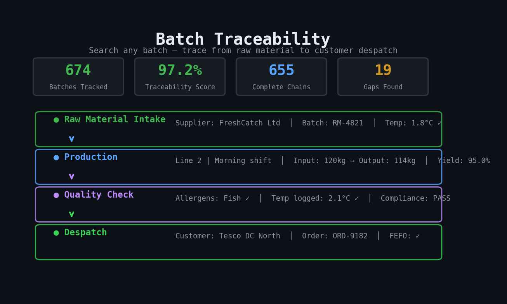
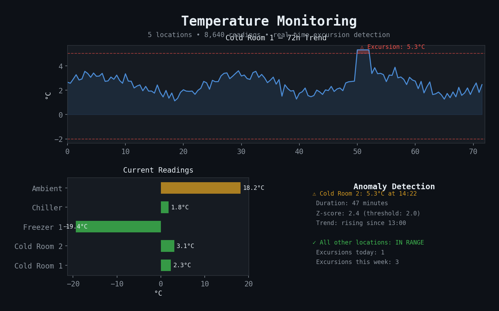
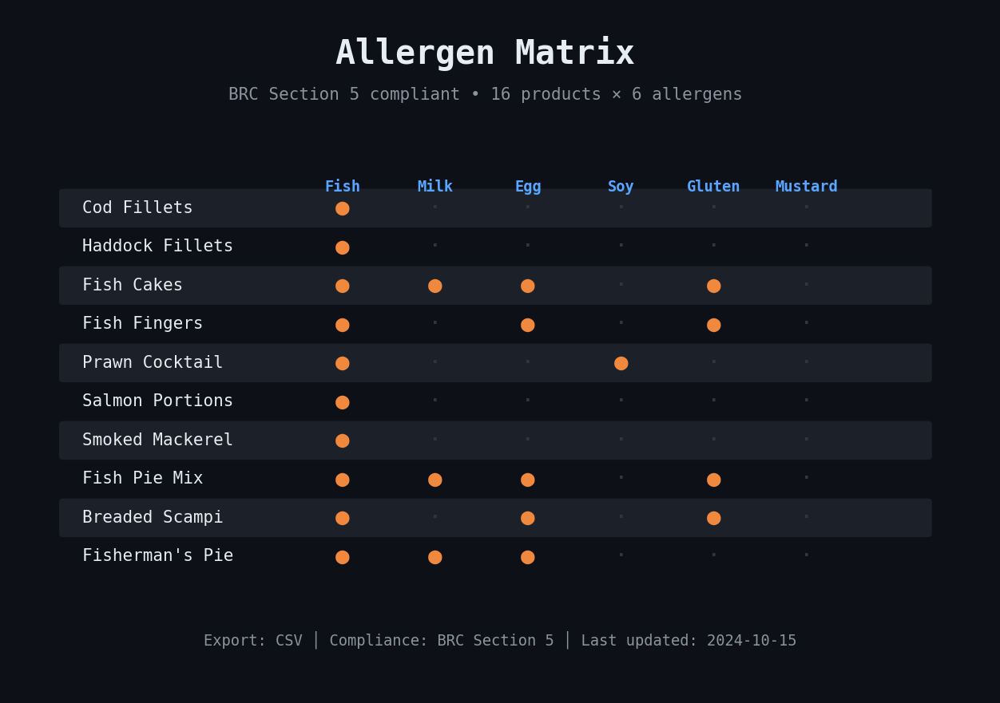

<div align="center">

# Manufacturing Compliance Dashboard

**BRC/HACCP food safety compliance — replaces your Excel spreadsheets**

Supports BRC compliance for fish production including RSPCA/GG grading, waterfall yield tracking, and batch traceability from catch area to packed product.

[](https://manufacturing-compliance-dashboard-mjappkncanejzlfr5ngghik.streamlit.app)
[]()
[]()

</div>

---

Auditor asks for Batch 4821's traceability chain. Someone spends 20 minutes in Excel. This dashboard does it in 2 seconds.

**[Try the live dashboard &rarr;](https://manufacturing-compliance-dashboard-mjappkncanejzlfr5ngghik.streamlit.app)**

---

## See it run

<!-- DROP YOUR SCREENSHOTS HERE -->
<!-- Recommended: 3 screenshots from the live dashboard -->
<div align="center">

| Batch Traceability | Temperature Monitoring | Allergen Matrix |
|---|---|---|
|  |  |  |

</div>

```
$ make setup && make run

┌─────────────────────────────────────────────────────────────┐
│  Manufacturing Compliance Dashboard                         │
│                                                             │
│  ┌──────────────────────────────────────────────────────┐  │
│  │ COMPLIANCE SCORE                                      │  │
│  │ Temperature Control:  99.1%  ██████████████████████░  │  │
│  │ Traceability:         97.2%  █████████████████████░░  │  │
│  │ Overall:              98.1%  ██████████████████████░  │  │
│  │ Status:               ✅ PASS                         │  │
│  └──────────────────────────────────────────────────────┘  │
│                                                             │
│  Batches tracked:        674                                │
│  Temperature readings:   8,640                              │
│  Orders monitored:       271                                │
│  Products in matrix:     16                                 │
└─────────────────────────────────────────────────────────────┘
```

---

## What it does — all 4 tabs

```
┌─────────────────────────────────────────────────────────────┐
│  TAB 1: BATCH TRACEABILITY                                  │
│                                                             │
│  Search: Batch COD-2024-0847                                │
│                                                             │
│  Raw Material Intake                                        │
│    Supplier: FreshCatch Ltd │ Batch: RM-4821               │
│    Date: 2024-03-15 06:12  │ Temp: 1.8°C ✓                │
│                                                             │
│  Production                                                 │
│    Line: 2  │ Shift: Morning │ Operator: J. Smith          │
│    Input: 120kg │ Output: 114kg │ Waste: 6kg               │
│    Yield: 95.0%                                             │
│                                                             │
│  Despatch                                                   │
│    Customer: Tesco DC North │ Order: ORD-9182              │
│    Temp at load: 2.1°C ✓  │ FEFO: ✓                       │
│                                                             │
│  Chain complete: Raw material → Production → Despatch ✓    │
│  Traceability score: 100%                                   │
├─────────────────────────────────────────────────────────────┤
│  TAB 2: TEMPERATURE MONITORING                              │
│                                                             │
│  ┌─ Cold Room 1 ──────────────────────────────────────┐    │
│  │  Current: 2.3°C  │  Min: -2.0°C  │  Max: 5.0°C   │    │
│  │  Status: ✅ IN RANGE                                │    │
│  │  ────────────────────────────────────────           │    │
│  │  3.1 2.8 2.3 2.5 2.1 2.4 2.3  (30-day trend)     │    │
│  └────────────────────────────────────────────────────┘    │
│                                                             │
│  ┌─ Freezer 1 ────────────────────────────────────────┐    │
│  │  Current: -19.4°C │ Min: -25.0°C │ Max: -15.0°C   │    │
│  │  Status: ✅ IN RANGE                                │    │
│  └────────────────────────────────────────────────────┘    │
│                                                             │
│  Anomaly Detection (z-score):                               │
│  ⚠ Cold Room 2: 5.3°C at 14:22 — exceeds 5.0°C threshold │
│  ⚠ Duration: 47 minutes │ Trend: rising since 13:00       │
│                                                             │
├─────────────────────────────────────────────────────────────┤
│  TAB 3: ALLERGEN MATRIX                                     │
│                                                             │
│  Product        │ Fish │ Milk │ Egg │ Soy │ Gluten │ Nuts │
│  ───────────────┼──────┼──────┼─────┼─────┼────────┼──────│
│  Cod Fillets    │  ●   │      │     │     │        │      │
│  Fish Cakes     │  ●   │  ●   │  ●  │     │   ●    │      │
│  Prawn Cocktail │  ●   │      │     │  ●  │        │      │
│  Fish Fingers   │  ●   │      │  ●  │     │   ●    │      │
│                                                             │
│  BRC Section 5 compliant │ Export to CSV │                  │
│                                                             │
├─────────────────────────────────────────────────────────────┤
│  TAB 4: AUDIT REPORT                                        │
│                                                             │
│  [Generate Report]                                          │
│  → Compliance score: 98.1% PASS                             │
│  → Temperature excursions: 3 (all <60 min)                 │
│  → Traceability gaps: 2 batches (97.2% coverage)           │
│  → Allergen matrix: 16 products × 6 allergens              │
│  → Shelf life concessions: 1                                │
│  → Export: [PDF] [JSON]                                     │
└─────────────────────────────────────────────────────────────┘
```

---

## Fish Production Compliance Features

### Temperature Monitoring & Shelf Life
Temperature monitoring with breach detection linked to shelf life extensions (+2/+3 superchill). Excursions are flagged in real time with duration tracking, and breaches automatically trigger shelf life concession reviews.

### Allergen Matrix
Allergen matrix supporting fish production allergens: fish, crustaceans, molluscs, wheat, egg, milk, and mustard. BRC Section 5 compliant with full cross-contact risk assessment and CSV export.

### Batch Traceability
Batch traceability supporting OCM scan-back lineage with parent-child batch mapping. Every batch is traceable from catch area through processing to packed product, with full chain scoring.

### Weight Variance Reconciliation
Weight variance reconciliation for BRC compliance across Lidl and Iceland product lines. Input/output yields are tracked per batch with waterfall reporting to identify loss points.

### Golden Rule Enforcement

> **The dashboard enforces the golden rule: RSPCA material can cascade down to GG products, but GG material can never be upgraded to RSPCA. Tail pieces are never packed into RSPCA products.**

---

## Architecture

```
                              ┌──────────────────────────┐
                              │    Streamlit Dashboard    │
                              │    (4 tabs, Plotly charts)│
                              └────────────┬─────────────┘
                                           │
              ┌────────────────┬───────────┼───────────┬────────────────┐
              ▼                ▼           ▼           ▼                ▼
     ┌──────────────┐ ┌──────────────┐ ┌────────┐ ┌────────────┐ ┌────────┐
     │ Traceability  │ │ Temperature   │ │Allergen│ │ Anomaly     │ │ Report │
     │ Engine        │ │ Monitor       │ │ Matrix │ │ Detection   │ │ Gen    │
     │               │ │               │ │        │ │ (z-score)   │ │(PDF)   │
     │ batch chains  │ │ thresholds    │ │ BRC §5 │ │ excursion   │ │        │
     │ FEFO check    │ │ 5 locations   │ │ export │ │ duration    │ │        │
     │ scoring       │ │ trend charts  │ │        │ │ forecasting │ │        │
     └──────┬───────┘ └──────┬───────┘ └───┬────┘ └─────┬──────┘ └───┬────┘
            │                │             │             │            │
            └────────────────┴─────────────┴─────────────┴────────────┘
                                           │
                              ┌────────────┴─────────────┐
                              │  SQLite / PostgreSQL      │
                              │  674 batches              │
                              │  8,640 temp readings      │
                              │  271 orders, 16 products  │
                              └────────────┬─────────────┘
                                           │
                              ┌────────────┴─────────────┐
                              │  PySpark / Databricks     │
                              │  Batch analytics:         │
                              │  yield, OEE, excursion    │
                              │  rates, shelf life risk   │
                              └──────────────────────────┘
```

---

## Build it

```bash
# Step 1: Clone and install
git clone https://github.com/Pawansingh3889/manufacturing-compliance-dashboard.git
cd manufacturing-compliance-dashboard
pip install -r requirements.txt

# Step 2: Seed 60 days of demo data
python data/seed_demo.py
# → Products: 10 | Production: ~500 | Orders: ~270
# → Temperature logs: ~19,000 (5 locations, 8 readings/day)
# → Raw materials: ~200 supplier deliveries

# Step 3: Run
streamlit run app.py
# → Dashboard at http://localhost:8501
```

Or one-liner: `make setup && make run`

---

## Configure for your factory

```yaml
# config.yaml — edit thresholds per location
temperature:
  locations:
    Cold Room 1:
      min: -2.0
      max: 5.0
    Cold Room 2:
      min: -2.0
      max: 5.0
    Freezer 1:
      min: -25.0
      max: -15.0
    Chiller (Dispatch):
      min: 0.0
      max: 5.0
    Ambient Store:
      min: 10.0
      max: 25.0

allergens:
  - Fish
  - Crustaceans
  - Molluscs
  - Wheat
  - Egg
  - Milk
  - Mustard
```

Upload your own data via the Excel/CSV upload tab — columns are validated automatically.

---

## Stack

| Component | Tool |
|---|---|
| Dashboard | Streamlit (4 tabs) |
| Charts | Plotly |
| Database | SQLite (demo) / PostgreSQL (production) |
| Batch Analytics | PySpark, Databricks |
| Anomaly Detection | scipy z-score, excursion duration, trend forecasting |
| Reports | fpdf2 (PDF), JSON |
| Deployment | Docker, Streamlit Cloud |

---

Built by someone who works on the factory floor. 674 batches tracked, 8,640 temperature readings monitored, one-click audit reports.

**[Live Dashboard](https://manufacturing-compliance-dashboard-mjappkncanejzlfr5ngghik.streamlit.app)** &#183; **[Report Bug](https://github.com/Pawansingh3889/manufacturing-compliance-dashboard/issues)**
